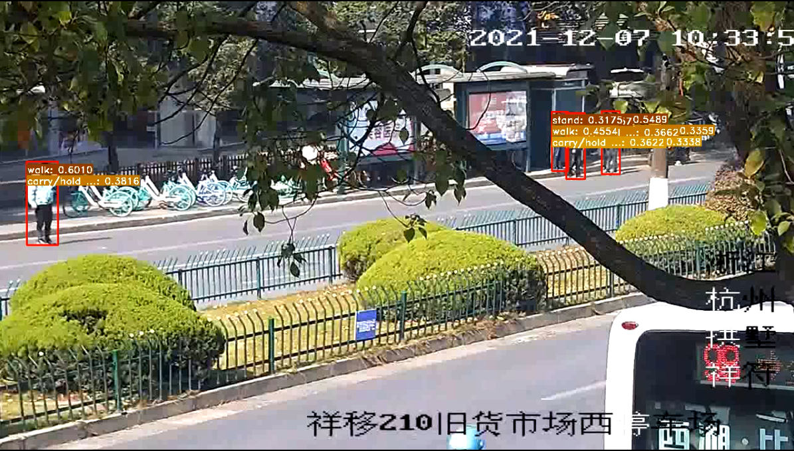

# action_det API

## 一、接口说明

该接口为基于视频段的动作识别算法接口。

输入为一个clip的视频段和待检测人的bboxs，输出为该视频段中对应bbox里面人的动作类型。

目前仅支持结构：slowonly_omnisource_pretrained_r101_8x8x1_20e_ava_rgb_infer.py配置的inference。

代码由官方代码重构而得， 官方代码见：https://github.com/open-mmlab/mmaction2.git

mmaction2文档见：https://mmaction2.readthedocs.io/zh_CN/latest/

视频流进行动作检测的代码参考了：https://github.com/open-mmlab/mmaction2/blob/master/demo/webcam_demo_spatiotemporal_det.py

该api检测结果可视化如下图： 

## 二、环境配置

**首先用pip install -r requirements.txt安装其他依赖**

**然后安装mmcv-full**

mmcv详细安装见：https://github.com/open-mmlab/mmcv

本仓库基于cuda10.2，以及pytorch1.8.0，所以安装mmcv-full使用的命令为：

pip install mmcv-full==1.4.1 -f https://download.openmmlab.com/mmcv/dist/cu102/torch1.8.0/index.html 

最后安装的mmcv-full版本为1.4.1

**最后安装mmaction2**

```
git clone https://github.com/open-mmlab/mmaction2.git
cd mmaction2
pip install -r requirements/build.txt
pip install -v -e .  # or "python setup.py develop"
```

## 三、参数说明

**action_det.src.sta_det.StdetPredictor**

视频片段时空动作检测类

类构建参数：

1. model_cfg: str, 模型结构参数路径，参数在“./action_det/src/configs”中，目前支持仅slowonly_omnisource_pretrained_r101_8x8x1_20e_ava_rgb_infer.py

2. model_weights: str, 模型权重路径，可在44服务器，路径“./action_det/src/weights”中获取，

   目前只支持slowonly_omnisource_pretrained_r101_8x8x1_20e_ava_rgb_infer.py结构对应的权重参数：slowonly_omnisource_pretrained_r101_8x8x1_20e_ava_rgb_20201217-16378594.pth，

   该权重参数是slowonly_omnisource_pretrained_r101_8x8x1_20e_ava_rgb_infer.py结构模型在OmniSource数据集上预训练ava2.1数据集上训练的权重

3. device: torch.device object, 推理的device

4. score_thres: float, 动作阈值，超过该阈值的认为该人进行了分值对应的动作。

5. label_map_path: 类别与类别名称映射表，目前支持”./action_det/src/configs/label_map.txt“

###### **action_det.src.sta_det.StdetPredictor**.inference_single_clip

单张图片人体骨架关键点检测方法

1. 输入参数：
    frames: list, 输入视频clip的图片list，元素类型为ndarray，shape:(H, W, 3), 通道顺序：BGR
    bboxs: torch.float32, 输入视频clip的关键帧行人检测结果，(N, 5), (:, :4)分别为bbox左上角右下角xy坐标, (:, 4)代表置信度

2. 输出结果:

   类型: dict, 

   key: bbox_id, 

   values: list, 元素为[action_name(str), score(float)]

## 四、使用样例

**you can use it as submodule**

在自己的项目目录下，git submodule add  https://github.com/ahaqu01/action_det.git

便会在项目目录下下载到action_det相关代码

下载完成后，便可在自己项目中使用action_det API，**使用样例**如下：

```python
import cv2
import torch
from action_det.src.sta_det import StdetPredictor

device = torch.device('cuda:0' if torch.cuda.is_available() else 'cpu')
stadet = StdetPredictor(     	     
    model_cfg="./action_det/src/configs/slowonly_omnisource_pretrained_r101_8x8x1_20e_ava_rgb_infer.py",
    model_weights="./action_det/src/weights/slowonly_omnisource_pretrained_r101_8x8x1_20e_ava_rgb_20201217-16378594.pth",
    stdet_input_shortside=256,
    device=device,
    score_thres=0.3,
    label_map_path="./action_det/src/configs/label_map.txt")
# frames: list, 元素为ndarray, shape：(H, W, 3), 通道顺序：BGR
# bboxs: torch.float32, (N, 5), (:, :4)分别为bbox左上角右下角xy坐标, (:, 4)代表置信度
result = stadet.inference_single_clip(frames, bboxs)
```
